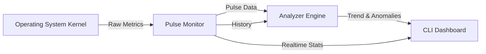

# System Architecture: The Digital Cortex

## Overview

**The Memory Pulse** is designed as a non-intrusive, real-time monitoring system that sits atop the operating system's kernel interfaces. It treats memory management not just as a resource allocation table, but as a dynamic, flowing system—a "pulse".

## Core Components

### 1. The Pulse Monitor (`src/core/pulse_monitor.py`)
This is the sensory organ of the system. It interfaces with OS APIs (via `psutil`) to retrieve raw telemetry:
-   **Volatile Memory (RAM)**: Active working set.
-   **Page File (Swap)**: Virtual memory backing store.
-   **Bandwidth Proxy**: Correlates Network and Disk I/O to estimate system throughput load.

### 2. The Analyzer Engine (`src/core/analyzer.py`)
Raw data is noise without interpretation. The Analyzer applies statistical models to the data stream:
-   **Trend Analysis**: Uses Linear Regression (`polyfit`) to determine if memory pressure is increasing, decreasing, or stable.
-   **Anomaly Detection**: Uses Z-Score statistical analysis to flag unexpected spikes in usage.

### 3. The Visual Interface (`src/cli.py`)
The "conscious mind" of the tool. It renders a terminal-based dashboard using the `rich` library, presenting data in a high-fidelity, refreshable layout.

## Data Flow

## Future Expansion: The Neural Link
We plan to introduce a neural network layer (`src/ai`) that learns the "normal" behavior of a specific user's workload and predicts Out-Of-Memory (OOM) events before they happen.
