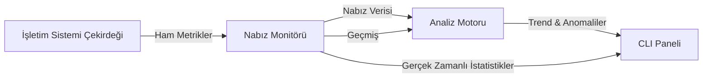

# Sistem Mimarisi: Dijital Korteks

## Genel Bakış

**The Memory Pulse**, işletim sistemi çekirdek arayüzlerinin üzerinde duran, müdahaleci olmayan, gerçek zamanlı bir izleme sistemi olarak tasarlanmıştır. Hafıza yönetimini sadece bir kaynak tahsis tablosu olarak değil, dinamik, akan bir sistem—bir "nabız" olarak ele alır.

## Temel Bileşenler

### 1. Nabız Monitörü (`src/core/pulse_monitor.py`)
Bu, sistemin duyu organıdır. Ham telemetriyi almak için OS API'leri (`psutil` aracılığıyla) ile arayüz oluşturur:
-   **Uçucu Bellek (RAM)**: Aktif çalışma seti.
-   **Disk Belleği Dosyası (Swap)**: Sanal bellek yedekleme deposu.
-   **Bant Genişliği Vekili**: Sistem verim yükünü tahmin etmek için Ağ ve Disk G/Ç'sini ilişkilendirir.

### 2. Analiz Motoru (`src/core/analyzer.py`)
Yorumlama olmadan ham veri gürültüdür. Analizci, veri akışına istatistiksel modeller uygular:
-   **Trend Analizi**: Bellek baskısının artıp artmadığını, azaldığını veya sabit kaldığını belirlemek için Doğrusal Regresyon (`polyfit`) kullanır.
-   **Anomali Tespiti**: Beklenmedik kullanım artışlarını işaretlemek için Z-Skoru istatistiksel analizini kullanır.

### 3. Görsel Arayüz (`src/cli.py`)
Aracın "bilinçli zihni". Verileri yüksek sadakatli, yenilenebilir bir düzende sunan `rich` kütüphanesini kullanarak terminal tabanlı bir kontrol paneli oluşturur.

## Veri Akışı

## Gelecek Genişleme: Nöral Bağlantı
Belirli bir kullanıcının iş yükünün "normal" davranışını öğrenen ve gerçekleşmeden önce Hafıza Yetersizliği (OOM) olaylarını tahmin eden bir sinir ağı katmanı (`src/ai`) sunmayı planlıyoruz.
